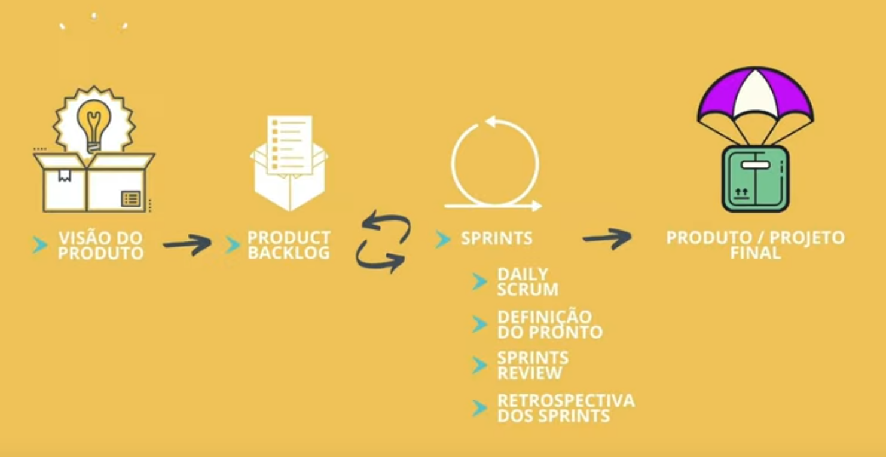

# Scrum
---
## Oque é?
Uma metodologia focada fácil entendimento para que o produto feito pela empresa
seja entrego dentro de ciclos chamados de Sprints, a metodologia é focada em 
possibilitar o trabalho conjunto mesmo em problemas complexos, mesmo assim dando
liberdade de escolha aos membros do projeto.
---
## Como funciona?
- ### 1 - Multifuncional
    Cada um designará seu papel dentro do projeto fazendo com que nos tornemos
    uma equipe multi funcional e organizada.
- ### 2 - Transparência
    Todos os envolvidos saberão oque ocorre em todas as etapas, evitando com que
    problemas surjam devido a falta de compatibilidade ou duas pessoas trabalhando
    em um mesmo item, isso incentiva o feedback continuo.
- ### 3 - Adaptabilidade
    O Scrum foi feito para ser flexivel fazendo com que assim que necessário possa
    ocorrem uma mudança no projeto Garantindo agilidade e responsividade durante
    seu desenvolvimento.
---
## Atores no Scrum
- ### 1 - Product Owner
Cliente que avalia e decide as funcionalidades e recursos, que são os backlogs.
- ### 2 - Scrum Master
Responsável pela gerência do Scrum, no nosso caso, como não há Hierarquia nós
faremos uma gerência de Scrum conjunta.
- ### 3 - Scrum Team
Profissionais responsaveis pelo projeto as equipes são auto gerenciaveis e 
trabalham de modo proativo, sabendo quais são as datas de entrega para cada ciclo
do projeto.
---
## Funcionalidades do Scrum
- ### Backlog
Lista de funcionalidades do projeto definida em ordem de prioridade pelo Product
Owner, a mesma lista sempre está em evolução constante, e as ordens de prioridade
podem ser alteradas caso seja necessário basicamente, uma lista de requisitos 
funcionais, na qual dentro de cada requisito funcional estarão listados seus
 requisitos não funcionais.
- ### Sprints
Ciclos com duração definida para que as funcionalidades do Backlog sejam entregues,
a duração pode ser definida entre dias ou até meses, mas é importante para que se 
tenha uma idéia da data de entrega do produto ao cliente, além de que mudanças
necessárias sejam acrecentadas ao backlog, para que sejam implementadas em sprints
futuras.
- ### Planejamento de Sprints
Aqui são definidas quantas funcionalidades do Product Backlog podem ser realizadas durante cada Sprint. É importante ressaltar que ao fim de cada Sprint, parte do 
produto deve ser entregue ao cliente.
- ### Daily Scrum
Reuniões diárias sobre oque precisa ser feito no projeto, o ideal é que sejam rápidas
com duração de cerca de 15 minutos com 3 perguntas basicas.
    - Oque foi feito ontem?
    - Oque será feito hoje?
    - Quais são os empedimentos?
- ### Definição do Pronto
Documentação de quando parte do produto ou funcionalidade está pronta, a mesma deve
ser realizada por todo o time em conjunto.
- ### Sprint Review
Ao terminar o sprint há uma revisão do sprint que consiste em declarar a evolução
do projeto e discutir a necessidade de adaptações.
- ### Retrospectiva do Sprint
Retrospectiva sobre as atividades realizadas, aprendizados, mudanças futuramente
necessárias e melhorias para o próximo Sprint.

---
- ## Resumo
